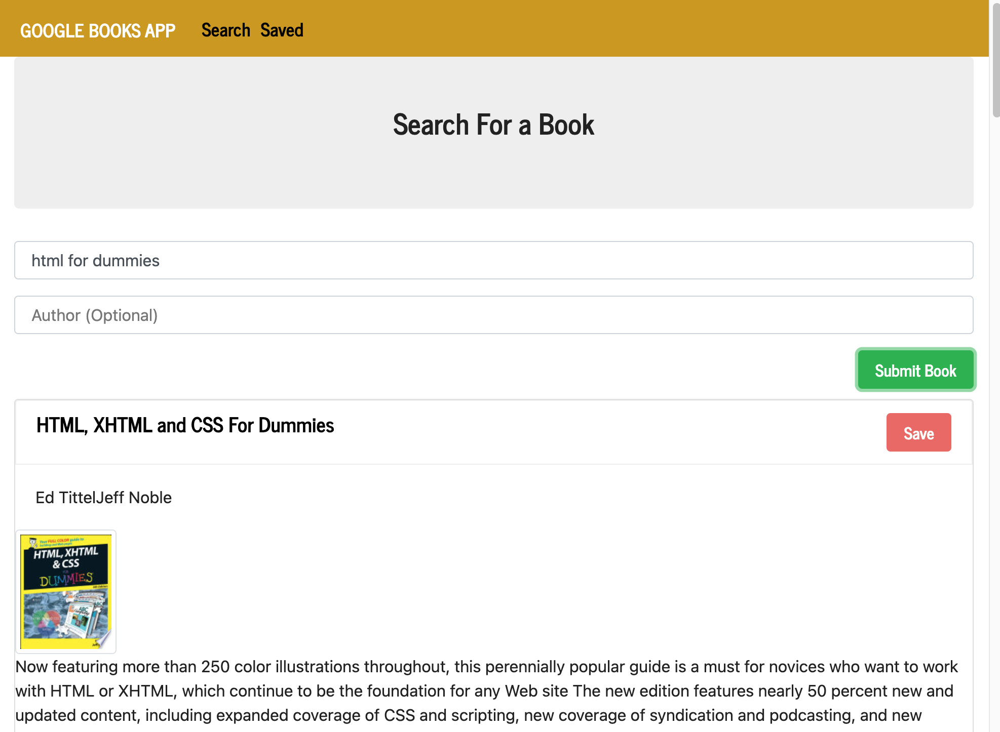
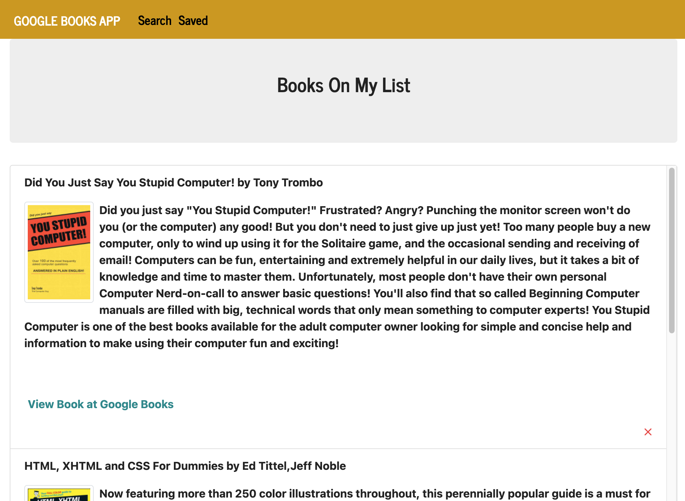

# GoogleBooksSearch

Deployed app:
https://enigmatic-garden-49283.herokuapp.com/

This app is a simple book search using the Google Books API.  

Users can search for books via the Google Books API and render them on the search page. They then have the option to "View" a book, bringing them to the book on Google Books, or "Save" a book, saving it to the Mongo database.

Clicking on the "Saved" link reveals all books saved to the Mongo database. Users then have the option to "View" the book, bringing them to the book on Google Books, or "Delete" a book, removing it from the Mongo database.

